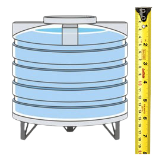
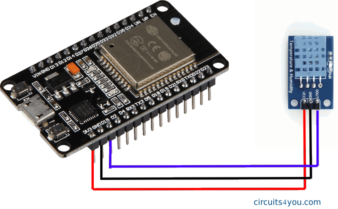
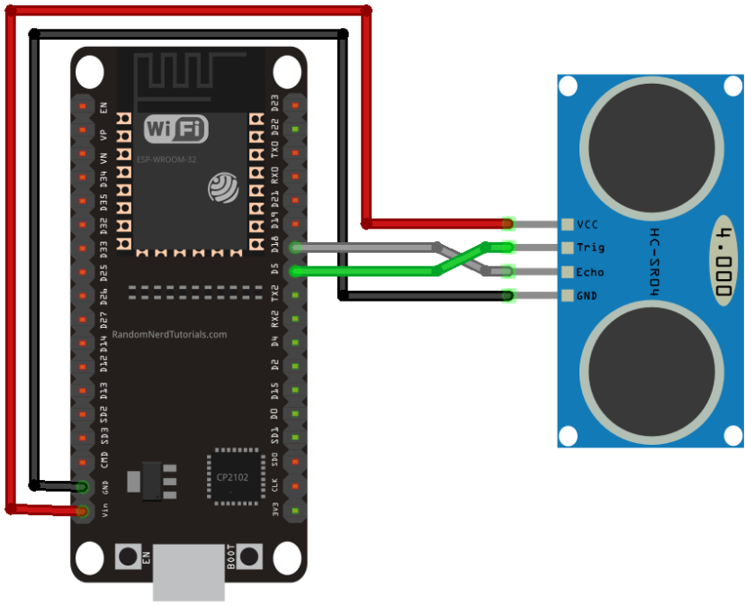
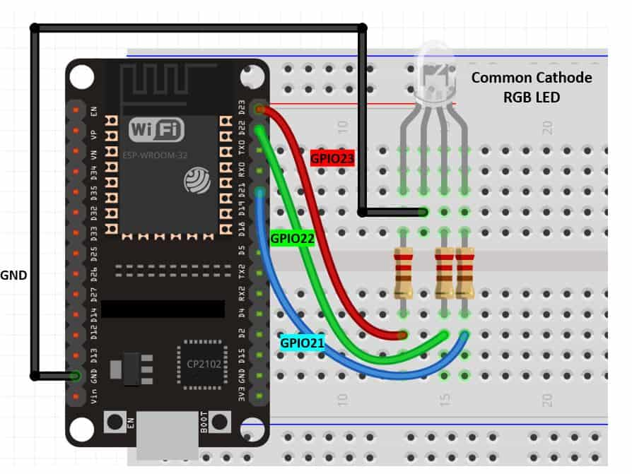

# Smart Watering App

## An IoT project

 

### Table of Contents
- [Description](#Description)
- [Components Used](#Components-Used)
- [Prerequisites](#Prerequisites)
- [Wiring](#Wiring)
- [Installations](#Installations)
- [Setting Up A Github Repository](#Setting-Up-A-Github-Repository)
- [Starting Node.js](#Node.js)
- [Coding](#Coding)
- [Worklog](#Worklog-and-Commits)
- [References](#References)

### Description:

This project uses an ESP-32, DHT-11 (Weather) Sensor and HR-S04 (Ultrasonic) Sensor to take reading on the weather and capacity of a water tank. This data is transfered over WiFi to the server so that you can check the weather and how much water is left in your tank at any time. This is useful so you can manage your water use and this project is the start of a fully automated watering system. This is because there is the potential to develop this idea a lot further with a rain-sensor model, soil moisture or an irrigation controller. 

Important: All of the code has been commented for easy understanding. In the firmware folder, in the arduino code (.ino) file, you will have to change the network name and password to whatever you want (your WiFi) because otherwise this project will not work.
 
 

 

### Components Used
In this project the components used were: 
> an ESP-32 - This is a microchip that we have used to send information to, and recieve information from, the sensors. This has integrated Wi-Fi and connects to our node application to provide real time data.

> HR-S04 (Ultrasonic Sensor) - Ultrasonic sensors can be used in many situations. For us, it is used to calculate the how much water is left in a water tank by finding the distance from the top of the water tank to the level of the water. This distance is then converted into a percentage of the maximum capacity. The calculations used are for a sample water tank.

> DHT-11 (Weather Sensor) - This is a weather sensor that will provide both the temperature and humidity.

> RGB LED Light - This is an output that is used to display the temperature. If it is cold, blue will be showing. If it is hot, red will be displayed.

 

### Prerequisites
Installation Guides Below.
> Components (Listed Above) with breadboard and cables

> Arduino IDE - for the backend coding

> VS Code - for setting up the server and webpages

> Github - for repository (see below for how to set up)

 

### Wiring 
The wiring diagrams for the components are seen below, however, because this project uses all of these components, the wiring is slightly differnt. Also, in the .ino file, the specific pins for wiring is different to those in the diagrams so you will need to change the pin number on the file or change where the wire go on your ESP-32.

DHT-11 and ESP-32:
 

 

Ultrasonic Sensor with ESP-32
 

 

RGB LED With and ESP-32:
 

 
 

### Installations
> Aruino: [Setting Up The Arduino IDE](https://www.arduino.cc/en/software)
Follow installation guide then install the following libraries: aREST Library, DHT Sensor Library and Adafruit Unified Sensor Library

> VS Code [Setting Up VS Code](https://code.visualstudio.com/download)
Follow the installation guide above

 

### Setting Up A Github Repository
Setting up a GitHub repository can be very, very useful so you have a record of your code.
 
Follow the guide to setup a repository by forking this repo: [How to Fork a GitHub Repository](https://docs.gitlab.com/ee/user/project/repository/forking_workflow.html)

 

### Development Roadmap

- [x] Setup repos - GitHub
- [x] setup ESP32 - Arduino IDE
- [x] Install dependencies - aREST.h and DHT.h
- [x] Test ESP32 - get json data via wifi
- [x] Initialize Node.js environment
- [x] setup server.js with express
- [x] set index route and views
- [x] link ESP32 to Node app with fetch

 

### Node.js 

1. Ensure that Node.js and NPM are installed on your system:
    > use 'node --version'

    > and 'npm --version'

2. In terminal, inside the project directory:
    > npm init -y

3. This will add a package.json file

4. Install dependencies
    > npm install express ejs express-ejs-layouts

5. Install development dependencies
    > npm install --save-dev dotenv nodemon
    
 

### Coding

1. Code the Adrduino -. 
    >  Taking the reading from the ultrasonic sensor and dht-11 weather sensor

    > LED code - vary the colour based on the temperature. I.e. if it is hot red is displayed, if it is cold, blue is displayed and so on.

2. Add code to create rest api and webserver
    > Get the JSON data via WiFi
    
4. Setup code to host the server
   > Index routes and views
   > Then an 'about page' with another route

6. Styling webpage 
     > Seup with head/footer and css
     
     > Put the readings from the sensors onto the webpage
   
 

### Worklog and Commits

Date | Commit Message | Version
:-----|:----------------:|:--------:
25.08.23 | initial setup | 0.1.0
7.09.23 | adding ultrasonic sensor and coding website  | 0.1.1
14.09.23 | adding navbar to the website and adding an ouptup | 0.1.2

 

### References

- [Web Page Layouts](https://www.youtube.com/watch?v=3C_22eBWpjg)
- [JS Native Fetch](https://www.youtube.com/watch?v=MBqS1kYzwTc)
- [HR-S04 Information](https://components101.com/sensors/ultrasonic-sensor-working-pinout-datasheet)
- [Tutorial for Ultrasonic Sensor](https://www.instructables.com/Ultrasonic-Water-Level-Indicator-Using-HC-SR04-Ard/)
- [About te DHT-11 Senor and How to Set Up](https://components101.com/sensors/dht11-temperature-sensor)
- [About the RGD LED](https://www.circuitbread.com/tutorials/how-rgb-leds-work-and-how-to-control-color)
- 

