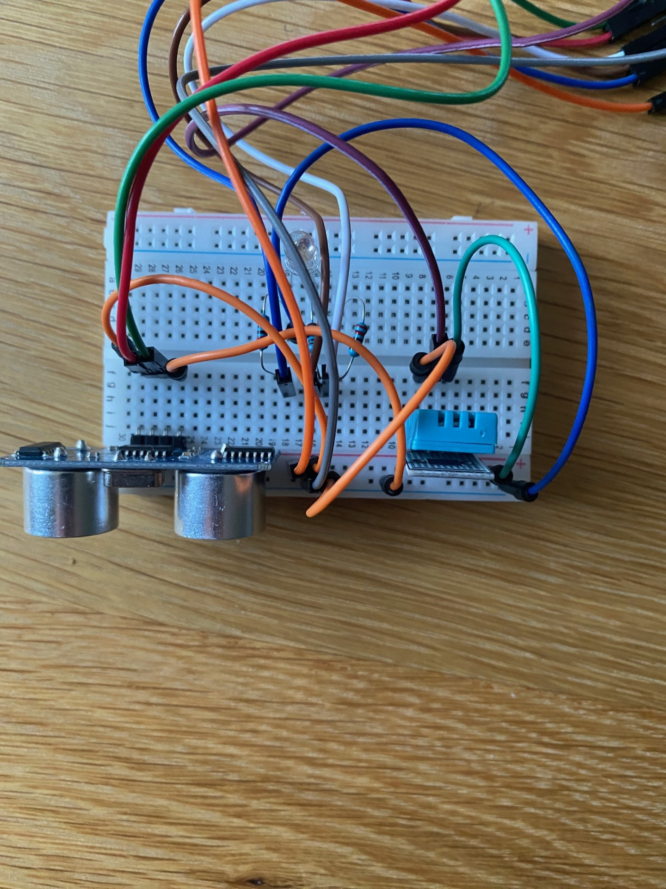
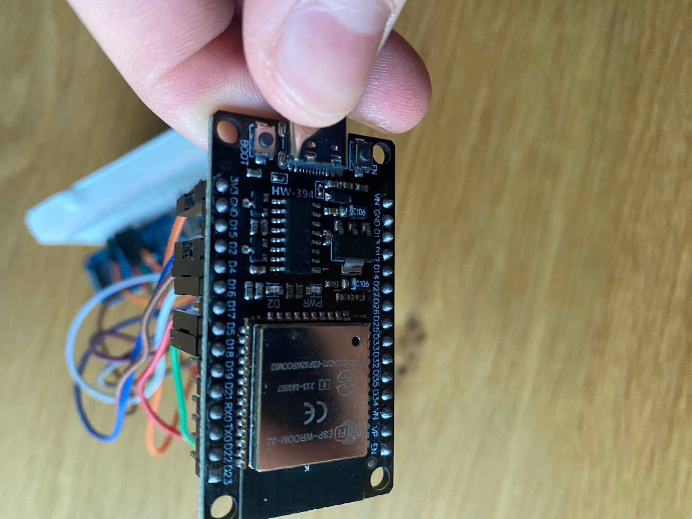
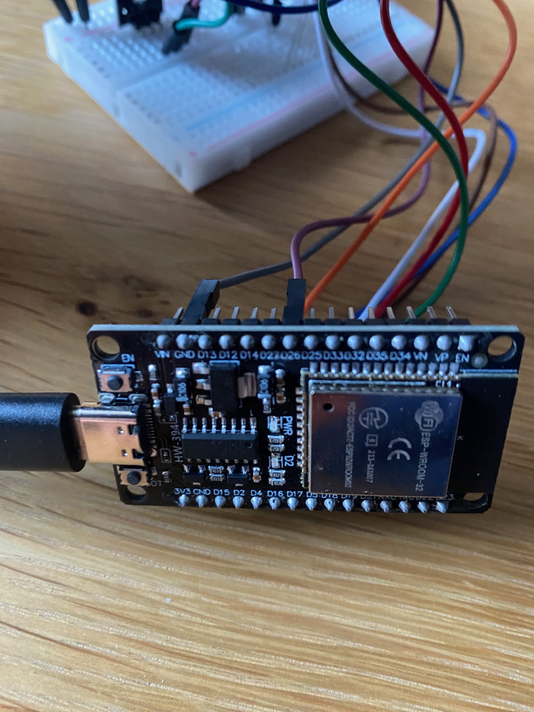

# Smart Watering App

## An IoT project

 

### Table of Contents
- [Description](#Description)
- [Components Used](#Components-Used)
- [Prerequisites](#Prerequisites)
- [Wiring](#Wiring)
- [Installations](#Installations)
- [Setting Up A Github Repository](#Setting-Up-A-Github-Repository)
- [Starting Node.js](#Node.js)
- [Coding](#Coding)
- [Worklog](#Worklog-and-Commits)
- [References](#References)

 

### Description and Purpose:

Overview: This project uses an ESP-32, DHT-11 (Weather) Sensor and HR-S04 (Ultrasonic) Sensor to take readings on the weather and capacity of a water tank. This data is transfered over WiFi to the server so that you can check the weather and how much water is left in your tank at any time. This is useful so you can manage your water use and this project is the start of a fully automated watering system. This is because there is the potential to develop this idea a lot further with a rain-sensor model, soil moisture or an irrigation controller. 

Purpose: This is designed to be the start of a fully automated IoT watering system.

Usage: This project is intended so that the ultrasonic sensor is placed on top of a water tank (with a powersource) and taking in data once every few minutes. It, combined with the weather sensor will transmit data over the WiFi to the server where you can chech the status at any time. It is also possible to do so while away or on holidays so that your garden will stay looking great!

Important: All of the code has been commented for easy understanding. In the firmware folder, in the arduino code (.ino) file, you will have to change the network name and password to whatever you want (your WiFi) because otherwise this project will not work.

 
 

 

### Components Used
This project used two different sensor imputs and a transducer output:
- an ESP-32 - This is a microchip that we have used to send information to, and recieve information from, the sensors. This has integrated Wi-Fi and connects to our node application to provide real time data.

- HR-S04 (Ultrasonic Sensor) - Ultrasonic sensors can be used in many situations. For us, it is used to calculate the how much water is left in a water tank by finding the distance from the top of the water tank to the level of the water. This distance is then converted into a percentage of the maximum capacity. The calculations used are for a sample water tank.

- DHT-11 (Weather Sensor) - This is a weather sensor that will provide both the temperature and humidity.

- RGB LED Light - In my project, this is the output that is used to display the a colour based on the temperature. For example, if it is cold, blue will be showing. If it is hot, red will be displayed.

 

### Prerequisites
Installation Guides Below.
- Components (Listed Above) with breadboard and cables

- Arduino IDE - for the backend coding

- VS Code - for setting up the server and webpages

- Github - for repository (see below for how to set up)

 

### Wiring 
The wiring diagrams for the components are seen below, however, because this project uses all of these components, the wiring is slightly differnt. Also, in the .ino file, the specific pins for wiring is different to those in the diagrams so you will need to change the pin number on the file or change where the wire go on your ESP-32.

DHT-11 and ESP-32:
 

 

Ultrasonic Sensor with ESP-32:
 

 

RGB LED With and ESP-32:
 

 

My Fully-Wired Smart Watering App:
 

 

 

 
 

### Installations
To ensure the smooth development and operation of this project, it's essential to set up the following programs and libraries. These installations will provide the necessary tools and resources for working with your project.

1. Arduino: [Setting Up The Arduino IDE](https://www.arduino.cc/en/software)
The Arduino Integrated Development Environment (IDE) is the primary platform for programming and uploading code to the ESP-32 and is the foundation for our project's hardware. Follow these steps to set it up:
    > Installation Guide: Begin by downloading the Arduino IDE from the official website . Choose the version that matches your operating system (Windows, macOS, or Linux). Follow the installation instructions specific to your platform. Then install the aREST Library that enables communication with other devices and platforms. You can do this from within the Arduino IDE. Open the IDE, go to "Sketch" > "Include Library" > "Manage Libraries," then search for and install the aREST library. You will also need DHT Sensor Library: For working with DHT (Distributed Humidity and Temperature) sensors, the DHT Sensor Library is essential. Install it in the same way as the aREST library. Finsally, get the Adafruit Unified Sensor Library - to interface with  sensors, we need the Adafruit Unified Sensor Library.

 

2. VS Code [Setting Up VS Code](https://code.visualstudio.com/download)
Visual Studio Code is a code editor that is used to edit and manage the project's code. Follow these steps to set up VS Code:
    > Installation Guide: Download and install Visual Studio Code from the website . Choose the version that matches your operating system. Follow the installation instructions provided for your platform.

  

3. Node JS [Setting Up Node Js](https://nodejs.org/en):
Node.js is a runtime environment that allows you to run JavaScript on the server-side, and it is good for our real-time communication and server-side logic. Follow these steps to set up Node.js:
    > Download Node.js: Visit the official Node.js website  and download the version that suits your operating system. 
     Installation: Once the download is complete, run the installation package and follow the installation instructions for your platform. During the installation process, the npm (Node Package Manager) will also be installed, which is essential for managing packages and dependencies in your Node.js projects.

 
 

### Setting Up A Github Repository
Setting up a GitHub repository can be very, very useful so you have a record of your code.
 
A step-by-step guide is detailed below, but to fork this repository and get started straight away, follow the link: [How to Fork a GitHub Repository](https://docs.gitlab.com/ee/user/project/repository/forking_workflow.html)

1. Create a GitHub Account:
    > If you don't already have a GitHub account, you'll need to sign up for one. Go to https://github.com/ and follow the instructions to create your account.
2. Create a New Repository:
    > Once you're logged in, click on the "+" sign in the upper right corner of the GitHub page and select "New repository". Then follow the prompts.
3. Initialise with a README:
    > If your project doesn't already have a README file, it's a good practice to check the "Initialize this repository with a README" option. A README provides information about your project and is a great place to document how to use your code.
4. Create Repository:
    > Click the "Create repository" button. Your new repository will be created, and you'll be directed to the repository's main page.
5. Set Up Local Git Configuration:
    > If you haven't already configured Git on your local machine, follow the instructions in the GitHub repository to set up your Git identity (username and email). This is essential for committing and pushing changes from your local machine to the remote repository.
6. Push Code:
    > If you have existing code you'd like to add to your repository, follow the instructions on the repository page under "…or push an existing repository from the command line." This will guide you through the process of connecting your local Git repository to the remote repository on GitHub.

 

### Development Roadmap

- [x] Setup repos - GitHub
- [x] setup ESP32 - Arduino IDE
- [x] Install dependencies - aREST.h and DHT.h
- [x] Test ESP32 - get json data via wifi
- [x] Initialize Node.js environment
- [x] setup server.js with express
- [x] set index route and views
- [x] link ESP32 to Node app with fetch

 

### Node.js 

This [article](https://www.w3schools.com/nodejs/nodejs_intro.asp) discusses what Node JS is, how/when to use it and some basic programming in Node.

1. Ensure that Node.js and NPM are installed on your system:
    > use 'node --version'

    > and 'npm --version'

2. In terminal, inside the project directory:
    > npm init -y

3. This will add a package.json file

4. Install dependencies
    > npm install express ejs express-ejs-layouts

5. Install development dependencies
    > npm install --save-dev dotenv nodemon
    
 
 

### Coding
This is the rough process I used to code the project. This can all be seen in the actual files in this repository.

1. Code the Adrduino:
    > Taking the reading from the ultrasonic sensor and dht-11 weather sensor

    > LED code - vary the colour based on the temperature. I.e. if it is hot red is displayed, if it is cold, blue is displayed and so on.

2. Add code to create rest api and webserver
    > Get the JSON data via WiFi
    
4. Setup code to host the server
   > Index routes and views
   > Then an 'about page' with another route

6. Styling webpage 
     > Seup with head/footer and css
     
     > Put the readings from the sensors onto the webpage

 

### Worklog and Commits

Date | Commit Message | Version
:-----|:----------------:|:--------:
25.08.23 | initial setup of weather sensor and arduino script | 0.1.0
7.09.23 | adding ultrasonic sensor and coding the server/website  | 0.1.1
14.09.23 | adding navbar to the website and adding an ouptup | 0.1.2
21.09.23 | adding an 'about' page and coding the extra routes | 0.1.3
07.10.23 | updating repository and completing readme.md | 0.1.4

 

### References

- The Website Architech (2021). How to Layout a Webpae [https://www.youtube.com/watch?v=3C_22eBWpjg](https://www.youtube.com/watch?v=3C_22eBWpjg)
  
- Fireship (2021). JS Native Fetch. [https://www.youtube.com/watch?v=MBqS1kYzwTc](https://www.youtube.com/watch?v=MBqS1kYzwTc)
  
- W3 Schools (2023). Node JS Introduction. [https://www.w3schools.com/nodejs/nodejs_intro.asp](https://www.w3schools.com/nodejs/nodejs_intro.asp)
  
- Components 101 (2021). HC-SR04 Ultrasonic Sensor. [https://components101.com/sensors/ultrasonic-sensor-working-pinout-datashee](https://components101.com/sensors/ultrasonic-sensor-working-pinout-datasheet)
  
- Instructables (2021). Water Level Indicator Using a HC-SR04 [https://www.instructables.com/Ultrasonic-Water-Level-Indicator-Using-HC-SR04-Ard/](https://www.instructables.com/Ultrasonic-Water-Level-Indicator-Using-HC-SR04-Ard/)

- Components 101 (2021). DHT-11 Temperature Sensor. [https://components101.com/sensors/dht11-temperature-sensor](https://components101.com/sensors/dht11-temperature-sensor)
  
- Circuit Bread (2019). How LED's Work and How to Control Their Color. [https://www.circuitbread.com/tutorials/how-rgb-leds-work-and-how-to-control-color](https://www.circuitbread.com/tutorials/how-rgb-leds-work-and-how-to-control-color)
  
- LogRocket (2021). How to Use EJS to Template Your Node Application. [https://blog.logrocket.com/how-to-use-ejs-template-node-js-application/](https://blog.logrocket.com/how-to-use-ejs-template-node-js-application)

